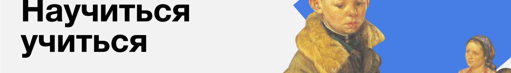

# How to Learn

[](https://github.com/kobewinona)
[](https://kobewinona.github.io/how-to-learn/)

[](https://dev.w3.org/html5/spec-LC/)
[](https://www.w3.org/TR/CSS/#css)
[](https://git-scm.com)
[](https://en.bem.info/methodology/)

[](https://code.visualstudio.com)

## contents

- [about this project](#about-this-project)
- [what I've learnt doing this project](#what-Ive-learnt-doing-this-project)
- [CSS syntax decoration I used in this project](#CSS-syntax-structure-I-used-in-this-project)
- [problems I've encountered doing this project](#problems-Ive-encountered-doing-this-project)
  - [problem #1](#problem-1)
  - [problem #2](#problem-2)

## about this project

This project has helped me better understand the basics of `HTML`, `CSS`, and IDE tools (VSCode in this case). In addition, I've become familiar with completely new things for me like `git` and `BEM`. I've also finally signed up at `GitHub`, which I never wanted to do before since I didn't recognize myself as a developer of any sorts (*still kind of hard to say that about myself since I'm still learning*). I've learned a lot from building this small page. Most importantly, I finally tried using `git`, which scared me a lot before. But now I can do very simple commands, and I actually understand what I'm doing (*most of the time* ☺).

The webpage itself is about better ways to learn, remembering new information, and mistakes in the learning process that have a negative impact on how much new information you actually absorb and can use well afterwards. While building this page, I learned about the Feynman method of learning, which is well reviewed [here](https://www.colorado.edu/artssciences-advising/resource-library/life-skills/the-feynman-technique-in-academic-coaching). To put it shortly, here are the main principles:

1. Step 1 – Study.
2. Step 2 - Teach.
3. Step 3 - Fill the Gaps.
4. Step 4 - Simplify.

Also, check out the ten major principles of effective learning by Josh Kaufman.

I hope this helps you in your learning journey!

## what I've learnt doing this project

1. I learned how to initialize the `git` control system for my project, how to use `SSH-keys` to connect the remote repository to my local one, and how to commit changes to the remote repository (GitHub in my case).
2. I also learned the basics and benefits of using BEM (Block, Element, Modifier), and specifically about the different types of file structure recommended by the BEM methodology. In this project, I used a `nested` file structure, which might be an exaggeration considering the size of the project. A `flex` or `flat` file structure would have been more reasonable, but it's good to know all the options. I hope this helps you with your own project!

## CSS syntax structure I used in this project

To make the code more readable for me, I decided to divide rules by their function:

```css
.header__title {
  width: 730px;

  font-size: 102px;
  font-weight: 600;
  line-height: 96px;

  position: relative;
  margin: 0 0 0 64px;

  z-index: 2;
}
```

**1st** block of lines describes an object in general:

```css
div {
  width: 0;
  min-height: 0;
  box-sizing: border-box;
  overflow: hidden;
}
```

**2nd** block of lines describes text and its decoration:

```css
div {
  color: #fff;
  font-size: 14px;
  font-weight: normal;
  text-align: center;
}
```

**3rd** block of lines describes an object's content layout:

```css
div {
  display: flex;
  flex-flow: row wrap;
  justify-content: space-between;
  column-gap: 0;
}
```

**4th** block of lines describes an object's position and size:

- *rules' order goes from the furthest* ❏ *to the closest* ■ *to content*

- *rules with sides*  *go from top to the left* ↻

```css
div {
  position: absolute;
  top: 0;
  right: 0;
  margin: 0;
  border: none;
  padding: 0;
}
```

**5th** block of lines is just `z-index` ☺.

Within these rules I try to maintain a certain order (still I sometimes fail).

## problems I've encountered doing this project 

### problem #1

In `video` section I decided to add an `<abbr>` tag to give **TED** a translation, but FireFox, GoogleChrome and Safari added an underline to the text. The simplest solution to get rid of that would be to use css styling, but for some reason it does not override normalize styling, which is this:

```css
abbr[title] {
  border-bottom: none; /* 1 */
  text-decoration: underline; /* 2 */
  text-decoration: underline dotted; /* 2 */
}
```

so this does not work:
```css
.abbreviation {
  text-decoration: none;
}
```

#### solution #1

for some reason a more specific selector overrides normalize styling just fine:

```css
.section-title .abbreviation {
  text-decoration: none;
}
```

#### solution #2

not the best way to do the job, but it gets rid of that stupid underline:

```html
<abbr style="text-decoration: none;"></abbr>
```

### problem #2

Using BEM Nested structure system caused a problem with absolute paths to files in CSS styling files. For some reason if you `@import` a CSS stylesheet it messes up the root folder for that file so all urls to images that I used in single CSS stylesheet stopped working of course.

#### solution

relative path

---

&hearts; thanks to yandex practicum team